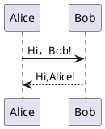
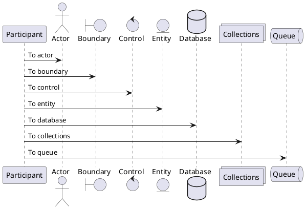
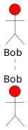
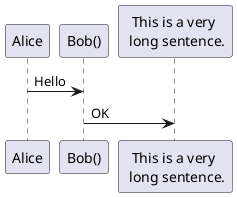
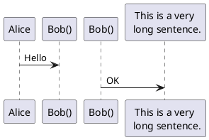
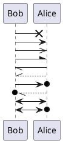
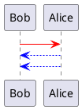
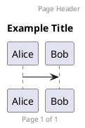

# 【plantUML 系列】（一）时序图

> plantUML 是一种可以方便快捷地绘制出各种逻辑图的开源语言。它支持绘制时序图、用例图、类图、对象图、活动图、组件图、部署图、状态图、定时图，同时还支持绘制 JSON Data、YAML Data、Network diagram、线框图形界面、架构图、SDL、等非 UML 图。
> 笔者因为想要在自己的 markdown 笔记中嵌入一些图表以更好地理解所学内容，故找到了这样的一个开源语言，博客内容即为笔者学习过程中的感悟，若有错误的地方可去本博客托管的[github 仓库](https://github.com/transparent-reid/MyBlog)下提 issue。

## 简单示例



```plantumlcode
@startuml
Alice -> Bob: Hi，Bob!
Alice <-- Bob: Hi,Alice!
@enduml
```

其中`->`代表实线，`-->`代表虚线。冒号后借箭头上想要写的注释。

## 声明参与者

使用`participant`关键字来声明一个参与者。
当然还有其他的一些关键字可以声明不同种类的参与者，这会改变参与者在图上的外观。
其中的关键字有：

- actor
- boundary
- control
- entity
- database
- collections
- queue

它们在图上会呈现出的样子：



```plantumlcode
@startuml
participant Participant as Foo
actor Actor as Foo1
boundary Boundary as Foo2
control Control as Foo3
entity Entity as Foo4
database Database as Foo5
collections Collections as Foo6
queue Queue as Foo7
Foo -> Foo1: To actor
Foo -> Foo2: To boundary
Foo -> Foo3: To control
Foo -> Foo4: To entity
Foo -> Foo5: To database
Foo -> Foo6: To collections
Foo -> Foo7: To queue
@enduml
```

关键字`as`用于重命名参与者，相当于给这些参与者起了一个“小名”，后面可以用这个“小名”来表示该参与者。

可以使用 RGB 或者颜色名修改参与者的北京颜色。
比如：



```plantumlcode
@startuml
actor Bob #red
@enduml
```

可以用`order`关键字自定义顺序来打印参与者。

```plantuml
@startuml
participant 最后 order 30
participant 中间 order 20
participant 首个
order 10
@enduml
```

```plantumlcode
@startuml
participant 最后 order 30
participant 中间 order 20
participant 首个 order 10
@enduml
```

## 在参与者中使用非字母符号

可以使用引号定义参与者，还可以用关键字 as 给参与者定义别名。



```plantumlcode
@startuml
Alice -> "Bob()": Hello
"Bob()" -> Long as "This is a very \n long sentence.": OK
@enduml
```

有一个很有趣的现象：

```plantumlcode
@startuml
Alice -> "Bob()": Hello
"Bob()" -> Long as "This is a very \n long sentence.": OK
@enduml
```

如果把`Alice -> "Bob()"`改为`Alice -> "Bob()" as Bob`则会变成下面这样：



如果将其改为`Bob as "Bob()"`也会变成这样。貌似 Bob 和“Bob()”不是同一个参与者一样。
我的猜想是，可能带引号的定义无法作为参数传递，用常规的变量定义方法才能正常传递。由此可知，带引号的定义应该算是一种临时的定义方法，一个参与者只能使用一次。

## 给自己发消息

参与者可以给自己发消息。
例如：

```plantumlcode
@startuml
Alice -> Alice: Something...
@enduml
```

## 修改箭头样式

修改箭头样式的方式有以下几种：
具体在实例中对比参照吧。



```plantumlcode
@startuml
Bob ->x Alice
Bob -> Alice
Bob ->> Alice
Bob -\ Alice
Bob \\- Alice
Bob //-- Alice

Bob ->o Alice
Bob o\\-- Alice

Bob <-> Alice
Bob <->o Alice
@enduml
```

按顺序从上到下对比参照。

## 修改箭头颜色

和修改参与者的背景颜色相似。



```plantumlcode
@startuml
Bob -[#red]> Alice
Alice --[#0000FF]>Bob
Alice -[#0000FF]->Bob
```

注意第二条和第三条的区别，这两个都可以。

## 页面标题，页眉，页脚

使用`title`关键字增加标题
使用`header`关键词增加页眉
使用`footer`关键词增加页脚



```plantumlcode
@startuml
header Page Header
footer Page %page% of %lastpage%

title Example Title

Alice -> Bob

@enduml
```

## 分割示意图

关键字`newpage`用于把一张图分割成多张。
暂时没啥用，需要的自己去查吧。

先写这么多吧。。。
